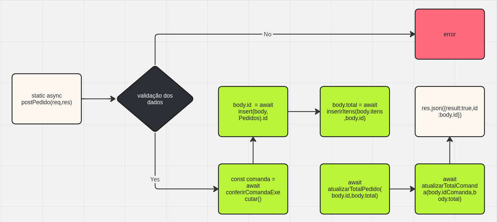

<h1 align ="center" > PI-Pastelaria-2024-01 <br>  </h1>

<h2 align ="center">  🚧 O projeto tem como objetivo gerir comandas de uma pastelaria 🚧 </h2>

> [!IMPORTANT]
> Esse é um projeto que está sendo desenvolvido para o Projeto integrador do 2° semestre de Análise e Desenvolvimento de Sistema, na Fatec Dr. Archimedes Lammoglia .

---

# Índice

- [Sobre o projeto](#sobre-o-projeto)
- [Design do projeto](#lorem)
- [lorem](#lorem)
- [lorem](#lorem)
- [lorem](#lorem)
- [lorem](#lorem)
- [lorem](#lorem)
- [lorem](#lorem)
- [lorem](#lorem)
- [Rotas](#rotas)
  - [Rotas da tabela Mesas](#rotas-da-tabela-mesas)
  - [Rotas da tabela Usuarios](#rotas-da-tabela-usuarios)
  - [Rotas da tabela TipoItens](#rotas-da-tabela-tipoitens)
  - [Rotas da tabela Itens](#rotas-da-tabela-itens)
  - [Rotas da tabela Comandas](#rotas-da-tabela-comandas)
  - [Rotas da tabela Pedidos](#rotas-da-tabela-pedidos)
  - [Rotas da tabela ItensPedidos](#rotas-da-tabela-itenspedidos)
- [Funcionalidades do projeto](#funcionalidades-do-projeto)
  - [app.js](#appjs)
    - [Imports](#imports-do-app)
    - [Explicando o funcionamento do app](#explicando-o-funcionamento-do-app)
    - [Code](#code)
  - [routes.js](#routesjs)
    - [Imports](#imports-do-routes)
    - [Funções ou comandos mais utilizados](#funções-ou-comandos-mais-utilizados-no-routes)
  - [ormconfig.js](#ormconfigjs)
    - [Imports](#imports-do-ormconfig)
  - [crud.js](#crudjs)
    - [Imports](#imports-do-crud)
    - [Funções ou comandos mais utilizados](#funções-ou-comandos-mais-utilizados-no-crud)
    - [_getAll(table){...}_](#getalltable)
    - [_getById(body, table){...}_](#getbyidbody-table)
    - [_getSomeById(arrayId, table, arrayColumnsReturn){...}_](#getsomebyidarrayid-table-arraycolumnsreturn)
    - [_insert(body, table){...}_](#insertbody-table)
    - [_updateById(body, table){...}_](#updatebyidbody-table)
    - [_deleteById(body, table){...}_](#deletebyidbody-table)
    - [_conferirComanda(body, table){...}_](#conferircomandabody-table)
    - [_dataHora(){...}_](#datahora)
    - [_existeId(id){...}_](#existeidid)
  - [Models](#models)
    - [Imports dos models](#imports-dos-models)
    - [Estrutura](#estrutura)
    - [mesas.model.js](#mesasmodeljs)
      - [Colunas do Schema Mesas](#colunas-do-schema-mesas)
      - [Schema Mesas](#schema-mesas)
    - [tipoItens.model.js](#tipoitensmodeljs)
      - [Colunas do Schema TipoItens](#colunas-do-schema-tipoitens)
      - [Schema TipoItens](#schema-tipoitens)
    - [usuarios.model.js](#usuariosmodeljs)
      - [Colunas do Schema Usuarios](#colunas-do-schema-usuarios)
      - [Schema Usuarios](#schema-usuarios)
    - [itens.model.js](#itensmodeljs)
      - [Colunas do Schema Itens](#colunas-do-schema-itens)
      - [Schema Itens](#schema-itens)
    - [comandas.model.js](#comandasmodeljs)
      - [Colunas do Schema Comandas](#colunas-do-schema-comandas)
      - [Schema Comandas](#schema-comandas)
    - [pedidos.model.js](#pedidosmodeljs)
      - [Colunas do Schema Pedidos](#colunas-do-schema-pedidos)
      - [Schema Pedidos](#schema-pedidos)
    - [itensPedidos.model.js](#itenspedidosmodeljs)
      - [Colunas do Schema ItensPedidos](#colunas-do-schema-itenspedidos)
      - [Schema ItensPedidos](#schema-itenspedidos)
  - [Controllers](#controllers)

---

# lorem

lorem

# Sobre o Projeto

# Rotas

## Rotas da tabela Mesas

```Javascript
  router.get("/mesas", MesasController.getAllMesas); // Retorna todas as mesas cadastradas no banco de dados.
  router.post("/mesas", MesasController.postMesa); // Cadastra uma nova mesa no banco de dados.
  router.put("/mesas", MesasController.putMesa); // Altera o cadastro da mesa buscando pelo id.
  router.delete("/mesas", MesasController.deleteMesa); // Deleta o cadastro da mesa buscando pelo id.
  router.get("/mesas/:id", MesasController.getMesaById); //  Retorna uma mesa buscando pelo id.
```

## Rotas da tabela Usuarios

```Javascript
  router.get("/usuarios", UsuarioController.getAllUsuarios); // Retorna todas os usuarios cadastrados no banco de dados.
  router.post("/usuarios", UsuarioController.postUsuario); // Cadastra um novo Usuario no banco de dados.
  router.put("/usuarios", UsuarioController.putUsuario); // Altera o cadastro do usuario buscando pelo id.
  router.delete("/usuarios", UsuarioController.deleteUsuario); // Deleta o cadastro do usuario buscando pelo id.
  router.get("/usuarios/:id", UsuarioController.getUsuarioById); //  Retorna um usuario buscando pelo id.
```

## Rotas da tabela TipoItens

```Javascript
  router.get("/tipoitens", TipoItensController.getAllTipoItens); // Retorna todas os tipos de itens cadastrados no banco de dados.
  router.post("/tipoitens", TipoItensController.postTipoItens); // Cadastra um novo tipo de item no banco de dados.
  router.put("/tipoitens", TipoItensController.putTipoItens); // Altera o cadastro de um tipo de item buscando pelo id.
  router.delete("/tipoitens", TipoItensController.deleteTipoItens); // Deleta o cadastro de um tipo de item buscando pelo id.
  router.get("/tipoitens/:id", TipoItensController.getTipoItensById); //  Retorna um tipo de item buscando pelo id.
```

## Rotas da tabela Itens

```Javascript
  router.get("/itens", ItensController.getAllItens); // Retorna todas os itens cadastrados no banco de dados.
  router.post("/itens", ItensController.postItem); // Cadastra um novo item no banco de dados.
  router.put("/itens", ItensController.putItem); // Altera o cadastro do item buscando pelo id.
  router.delete("/itens", ItensController.deleteItem); // Deleta o cadastro do item buscando pelo id.
  router.get("/itens/:id", ItensController.getItemById); //  Retorna um item buscando pelo id.
```

## Rotas da tabela Comandas

```Javascript
  router.get("/comandas", ComandasController.getAllComandas); // Retorna todas as comandas cadastradas no banco de dados.
  router.post("/comandas", ComandasController.postComanda); // Cadastra uma nova comanda no banco de dados.
  router.put("/comandas", ComandasController.putComanda); // Altera o cadastro da comanda buscando pelo id.
  router.delete("/comandas", ComandasController.deleteComanda); // Deleta o cadastro da comanda buscando pelo id.
  router.get("/comandas/:id", ComandasController.getComandaById); //  Retorna uma comanda buscando pelo id.
```

## Rotas da tabela Pedidos

```Javascript
  router.get("/pedidos", PedidosController.getAllPedidos); // Retorna todas os pedidos cadastrados no banco de dados.
  router.post("/pedidos", PedidosController.postPedido); // Cadastra um novo pedido no banco de dados.
  router.put("/pedidos", PedidosController.putPedido); // Altera o cadastro do pedido buscando pelo id.
  router.delete("/pedidos", PedidosController.deletePedido); // Deleta o cadastro do pedido buscando pelo id.
  router.get("/pedidos/:id", PedidosController.getPedidoById); //  Retorna um pedido buscando pelo id.
```

## Rotas da tabela ItensPedidos

```Javascript
router.get("/itenspedidos", ItensPedidosController.getAllItensPedidos); // Retorna todas os itens de um pedido cadastrados no banco de dados.
router.get("/itenspedidos/:id", ItensPedidosController.getItensPedidosById); //  Retorna um item de um pedido buscando pelo id.
```

# Funcionalidades do projeto

## app.js

O arquivo app.js é o arquivo principal da API, onde todas as requisições passam por ele e são redirecionadas para a rota http que foi acessada, executando assim as funções atribuídas para as rotas.

### Imports do app

1. `import express from "express";`: Importa a função [express()](https://expressjs.com/en/5x/api.html#express), onde usamos para criar a aplicação express.
1. `import { router } from "./routes.js";` Importa a constante router, onde possuí todas as nossas rotas.

### Explicando o funcionamento do app

- `const app = express();`: Atribuímos à constante app a aplicação [`express()`](https://expressjs.com/en/5x/api.html#expres), que é o framework que utilizamos para construir a API. Veja a documentação oficial [aqui](https://expressjs.com/en/5x/api.html#expres).
- `const port = 3000;`: Atribuímos à constante port uma porta para possibilitar o acesso a API.
- `app.use(express.json());`: Utilizando o método [`.use()`](https://expressjs.com/en/5x/api.html#app.use) do app, e passando o método [`express.json()`](https://expressjs.com/en/api.html#express.json) podemos permitir que o express receba requisições utilizando o formato JSON.
- `app.use(router);`: Utilizando o método [`.use()`](https://expressjs.com/en/5x/api.html#app.use) do app, e passando a constante `router` importada do arquivo [routes.js](./src/routes.js), podemos utilizar um sistema de objeto de rotas. Veja a documentação oficial [aqui](https://expressjs.com/en/5x/api.html#router).
- `app.listen();`: Utilizando o método [`.listen()`](https://expressjs.com/en/5x/api.html#app.listen_path_callback) podemos receber requisições pela porta que passarmos no parâmetro. Veja a documentação oficial [aqui](https://expressjs.com/en/5x/api.html#app.listen_path_callback).

### _Code_

```Javascript
const app = express();
const port = 3000;
app.use(express.json());
app.use(router);

app.listen(port, ()=>{
  console.clear();
  console.log(`API executando na porta ${port}`);
});
```

## routes.js

### Imports do routes

1. `import { Router } from "express";`: Importa a função [Router()](https://expressjs.com/en/5x/api.html#router), onde usamos para criar um objeto de rotas do express.
1. `import UsuarioController from "./Controller/usuarios.controller.js";`: Importa o [controller do model Usuario](./src/Controller/usuarios.controller.js)
1. `import PedidosController from "./Controller/pedidos.controller.js";`: Importa o [controller do model Pedidos](./src/Controller/pedidos.controller.js)
1. `import MesasController from "./Controller/mesas.controller.js";`: Importa o [controller do model Mesas](./src/Controller/mesas.controller.js)
1. `import ItensController from "./Controller/itens.controller.js";`: Importa o [controller do model Itens](./src/Controller/itens.controller.js)
1. `import ComandasController from "./Controller/comandas.controller.js";`: Importa o [controller do model Comandas](./src/Controller/comandas.controller.js)
1. `import TipoItensController from "./Controller/tipoItens.controller.js";`: Importa o [controller do model TipoItens](./src/Controller/tipoItens.controller.js)
1. `import ItensPedidosController from "./Controller/itensPedidos.controller.js";`: Importa o [controller do model ItensPedidos](./src/Controller/itensPedidos.controller.js)

### Funções ou comandos mais utilizados no routes

- `export const router = Router();`: Exporta e atribui a constante router a função Router do express.
- `router.MetodoDeRequisição("/CaminhoDaRota", Controller.Função);`: Essa é a estrutura básica para criar uma rota usando o router do express. Para visualizar todas as rotas clique [aqui](#rotas). Veja a documentação oficial [aqui](https://expressjs.com/en/5x/api.html#router)

## ormconfig.js

### Imports do ormconfig

1. `import { DataSource } from "typeorm";`: Importa a class para que possamos configurar o objeto do banco de dados.Função
1. `import { Mesas } from "./Model/mesas.model.js";`: Importa o [model Usuario](./src/Controller/usuarios.controller.js)
1. `import { TipoItens } from "./Model/tipoItens.model.js";`: Importa o [controller do model Pedidos](./src/Controller/pedidos.controller.js)
1. `import { Itens } from "./Model/itens.model.js";`: Importa o [controller do model Mesas](./src/Controller/mesas.controller.js)
1. `import { ItensPedidos } from "./Model/itensPedidos.model.js";`: Importa o [controller do model Itens](./src/Controller/itens.controller.js)
1. `import { Pedidos } from "./Model/pedidos.model.js";`: Importa o [controller do model Comandas](./src/Controller/comandas.controller.js)
1. `import { Usuarios } from "./Model/usuarios.model.js";`: Importa o [controller do model TipoItens](./src/Controller/tipoItens.controller.js)
1. `import { Comandas } from "./Model/comandas.model.js";`: Importa o [controller do model ItensPedidos](./src/Controller/itensPedidos.controller.js)

### _const dataBase = new DataSource({...})_

Declara um objeto com as configurações do banco de dados utilizando a class DataSource

- _Função:_

  ```Javascript
  export const dataBase = new DataSource({
    type: "sqlite", // Tipo do banco de dados, que é o Sqlite
    database: "./database.db", // Caminho do banco
    entities: [
      Mesas,
      TipoItens,
      Itens,
      ItensPedidos,
      Pedidos,
      Usuarios,
      Comandas,
    ], // Classe das entidades (Tabelas) que estão no banco de dados.
    logging: true, // log das queries executadas
    synchronize: true, // cria as tabelas automaticamente
  });
  ```

### _dataBase.initialize()_

Inicializa o banco de dados.

- _Função:_

  ```Javascript
  dataBase // Variável do Banco de dados
  .initialize() // Função para inicializar o Banco de dados
  .then(() => { // Se deu certo ele entra aqui
    console.log(`Banco de dados inicializado`);
  })
  .catch((err) => { // Se deu algum erro ele entra aqui
    console.error(`Erro ao inicializar o banco de dados`, err);
  });
  ```

## crud.js

Funções básicas para inserir, alterar, selecionar e deletar do banco de dados.

### Imports do crud

1. `import { dataBase } from "./ormconfig.js";`: importa o objeto do banco de dados declarado no arquivo [ormconfig.js](./src/ormconfig.js);
1. `import { In } from "typeorm"` importa o operador In do typeorm para possibilitar consultas personalizadas.

### Funções ou comandos mais utilizados no crud

1. `const res = await dataBase...`: Atribui a constante res o resultado da consulta no banco de dados;
1. `.getRepository(table.options.name)`: Seleciona a entidade pelo nome passada no parâmetro table;
1. `.find(parâmetros)`: Procura na tabela com base nos parâmetros passados, caso não seja passado nenhum parâmetro, retorna toda a tabela.
1. `existeId(variável.id)`: Função com que executa um operador ternário para conferir se a propriedade onde deveria haver um id, realmente possui algum valor ou é undefined.

### _getAll(table){...}_

Retorna todos os registros de uma tabela.

- _Parâmetros:_

1. `table`: Recebe o valor de um objeto constante de uma entidade (uma tabela), definidos nos arquivos da pasta [Model](./src/Model), ou seja, recebe a tabela na qual irá executar a ação.

- _Função:_

  ```Javascript
  export async function getAll(table) {
    return await dataBase.getRepository(table.options.name).find();
  }
  ```

### _getById(body, table){...}_

Retorna o registro correspondente ao id passado.

- _Parâmetros:_

1. `body`: Objeto onde é extraído o id. Exemplo de como objeto que deve ser passado::

   ```Javascript
    {
      id: int, // Valor que será usado para realizar a ação
      propriedade2: valor,
      [...]
    }
   ```

2. `table`: Recebe o valor de um objeto constante de uma entidade (uma tabela), definidos nos arquivos da pasta [Model](./src/Model), ou seja, recebe a tabela na qual irá executar a ação.

- _Função:_

  ```Javascript
  export async function getById(body, table) {
    if (existeId(body.id)) {
      const res = await dataBase
        .getRepository(table.options.name)
        .find({ where: { id: body.id } }) // Utilizando o "where:{propriedade: valor}", filtramos o resultado que queremos, que no caso é o registro com o id correspondente passado no body.
        .catch((err) => {
          return err;
        });
      if (res[0]) { // Verifica se a consulta retornou alguma correspondência.
        res.result = true; // Atribui a propriedade "result:true" indicando uma consulta com resultado.
        return res; // Retorna a resposta da consulta.
      } else {
        return { result: false }; // Retorna um objeto com a propriedade "result:false" indicando uma consulta sem resultado.
      }
    } else {
      return err400;
    }
  }
  ```

### _getSomeById(arrayId, table, arrayColumnsReturn){...}_

Retorna o(s) registro(s) correspondente(s) ao(s) id(s) passado.

- _Parâmetros:_

1. `arrayId`: Array com um ou vários id para a consulta. Exemplo de como o array deve ser passado:

   ```Javascript
    [1,2...id_N]
   ```

2. `table`: Recebe o valor de um objeto constante de uma entidade (uma tabela), definidos nos arquivos da pasta [Model](./src/Model), ou seja, recebe a tabela na qual irá executar a ação.
3. `arrayColumnsReturn`: Array com um ou várias colunas que devem ser retornadas. Exemplo de como o array deve ser passado:

   ```Javascript
    ["nomeTabela.coluna1", "nomeTabela.coluna2"..."nomeTabela.coluna_N"]
   ```

- _Função:_

  ```Javascript
  export async function getSomeById(arrayId, table, arrayColumnsReturn) {
    if (existeId(arrayId[0])) {
      return await dataBase
        .getRepository(table.options.name)
        .createQueryBuilder(table.options.name) // Cria um query sql, permitindo nesse caso, que retornemos apenas as colunas necessárias.
        .select(arrayColumnsReturn) // Especifica as colunas que devem ser retornadas. Caso não passado o argumento, retorna todas.
        .where({ id: In(arrayId) }) // Filtra onde o id for igual a um dos elementos no array.
        .getRawMany(); // Executa o comando da query retornando todos os valores correspondentes.
    } else {
      return err400;
    }
  }
  ```

### _insert(body, table){...}_

Insere um novo registro na tabela utilizando os dados passados.

- _Parâmetros:_

1. `body`: Objeto onde é extraído os dados. Exemplo de como objeto que deve ser passado::

   ```Javascript
    {
      propriedade1: valor, // O nome da propriedade deve ser igual ao nome da coluna a qual faz referência, e o dado do mesmo tipo que a coluna.
      propriedade2: valor,
      [...]
    }
   ```

2. `table`: Recebe o valor de um objeto constante de uma entidade (uma tabela), definidos nos arquivos da pasta [Model](./src/Model), ou seja, recebe a tabela na qual irá executar a ação.

- _Função:_

  ```Javascript
  export async function insert(body, table) {
  const res = await dataBase
    .getRepository(table.options.name)
    .save(body) // Utiliza a função save() para inserir na tabela os dados do objeto body.
    .catch((err) => {
      return err;
    });
    return {result:true,id:res.id}; // Retorna o resultado como verdadeiro e o id referente aos dados inseridos no banco.
  }
  ```

### _updateById(body, table){...}_

Altera o registro correspondente ao id passado.

- _Parâmetros:_

1. `body`: Objeto onde é extraído os dados. Exemplo de como objeto que deve ser passado::

   ```Javascript
    {
      id: int,
      propriedade2: valor, // O nome da propriedade deve ser igual ao nome da coluna a qual faz referência, e o dado do mesmo tipo que a coluna.
      [...]
    }
   ```

2. `table`: Recebe o valor de um objeto constante de uma entidade (uma tabela), definidos nos arquivos da pasta [Model](./src/Model), ou seja, recebe a tabela na qual irá executar a ação.

- _Função:_

  ```Javascript
  export async function updateById(body, table) {
    if (existeId(body.id)) {
      try{
      await dataBase
        .getRepository(table.options.name)
        .update(body.id, body) // Utiliza a função update() para atualizar o registro na tabela utilizando os dados do objeto body.
        .catch((err) => {
          return err;
        });
      return { result: true, id: body.id };
      }catch(err){
        return err
      }
    } else {
      return err400;
    }
  }
  ```

### _deleteById(body, table){...}_

Deleta o registro correspondente ao id passado.

- _Parâmetros:_

1. `body`: Objeto onde é extraído o id. Exemplo de como objeto que deve ser passado::

   ```Javascript
    {
      id: int, // Valor que será usado para realizar a ação
      propriedade2: valor,
      [...]
    }
   ```

2. `table`: Recebe o valor de um objeto constante de uma entidade (uma tabela), definidos nos arquivos da pasta [Model](./src/Model), ou seja, recebe a tabela na qual irá executar a ação.

- _Função:_

  ```Javascript
  export async function updateById(body, table) {
  if (existeId(body.id)) {
    try {
      await dataBase
        .getRepository(table.options.name)
        .update(body.id, body)  // Utiliza a função delete() para deletar o registro na tabela utilizando o id no objeto body.
        .catch((err) => {
          return err;
        });
      return { result: true, id: body.id };
    } catch (err) {
      return err;
    }
  } else {
    return err400;
  }
  }
  ```

### _conferirComanda(body, table){...}_

Confere se há comanda aberta para o id da mesa passada.

- _Parâmetros:_

1. `body`: Objeto onde é extraído o id da mesa. Exemplo de como objeto que deve ser passado:

   ```Javascript
    {
      idMesa: int, // Valor que será usado para realizar a ação
      propriedade2: valor,
      [...]
    }
   ```

2. `table`: Recebe o valor de um objeto constante de uma entidade (uma tabela), definidos nos arquivos da pasta [Model](./src/Model), ou seja, recebe a tabela na qual irá executar a ação.

- _Função:_

  ```Javascript
    export async function conferirComanda(body, table) {
    if (existeId(body.idMesa)) {
      try {
        const res = await dataBase
          .getRepository(table.options.name)
          .find({ where: { idMesa: body.idMesa, aberta: 1 } }) // // Utilizando o "where:{propriedade: valor}", filtramos o resultado que queremos, que no caso é o registro da comanda com o id da mesa correspondente e que a comanda esteja aberta.
          .catch((err) => {
            return err;
          });
        if (res[0]) {
          return { result: true, id: res[0].id, valorTotal: res[0].valorTotal };
        } else {
          return { result: false };
        }
      } catch (err) {
        return err;
      }
    } else {
      return err400;
    }
  }
  ```

### _dataHora(){...}_

Retorna a data e hora do sistema formatada.

- _Função:_

  ```Javascript
  export function dataHora(){
    const date = new Date(); // Atribui a data do sistema a constante date
    return `
    ${date.getDate()} ${/*Extrai o dia da constante date*/}
    /${date.getMonth() + 1} ${/*Extrai o mês da constante date e soma +1 pois para o sistema janeiro é 0*/}
    /${date.getFullYear()} ${/*Extrai o ano completo da constante date*/}
    | ${date.getHours()} ${/*Extrai a hora da constante date*/}
    :${date.getMinutes()} ${/*Extrai os minutos da constante date*/}
    :${date.getSeconds()} ${/*Extrai os segundos da constante date*/}
    `;
  }
  ```

### _existeId(id){...}_

Confere se foi passado um id.

- _Parâmetros:_

1. `id`: Recebe o que deveria ser o id, e confere se realmente existe.

- _Função:_

  ```Javascript
  function existeId(id) {
    return id === undefined ? false : true;
  }
  ```

## Models

Models são o schema das tabelas do banco de dados, onde dizemos para o Typeorm como são as nossas tabelas, colunas e relacionamentos.

### Imports dos Models

1. `import { EntitySchema } from "typeorm";`: Todos os arquivos de models importam o EntitySchema, para que possamos construir nossas tabelas usando o schema do Typeorm.

### Estrutura

Veja a estrutura padrão da construção de um schema de tabelas usadas no projeto:

```Javascript
const Objeto /*Que irá receber o schema da tabela.*/ = new EntitySchema({
  name: "abreviação", // Nome que o typeorm usa como abreviação.
  tableName: "nome", // Nome da Tabela.
  columns: { // As colunas ficam dentro da propriedades columns.
    coluna1: {
      primary: true, // Se true o campo é tratado como chave primária, valor padrão é false.
      type: "int", // Tipo do valor do campo. O tipo varia de banco para banco utilizado, no Sqlite temos o integer,text,real, null e blob.
      generated: true, // Se true o campo é auto-incrementado, valor padrão é false.
    },
    colunas2: {
      type: "text",
    },
  },
});
```

### mesas.model.js

Contém o model da tabela mesas.

#### Colunas do schema Mesas

1. `id`: chave primária, inteiro, auto-incremento;
1. `localizacao`: texto.

#### Schema Mesas

```Javascript
export const Mesas = new EntitySchema({
  name: "mesas",
  tableName: "mesas",
  columns: {
    id: {
      primary: true,
      type: "int",
      generated: true,
    },
    localizacao: {
      type: "text",
    },
  },
});
```

### tipoItens.model.js

Contém o model da tabela tipoItens.

#### Colunas do schema TipoItens

1. `id`: chave primária, inteiro, auto-incremento;
1. `nome`: texto.

#### Schema TipoItens

```Javascript
export const TipoItens = new EntitySchema({
  name: "tipoItens",
  tableName: "tipoItens",
  columns: {
    id: {
      primary: true,
      type: "int",
      generated: true,
    },
    nome: {
      type: "text",
    },
  },
});
```

### usuarios.model.js

Contém o model da tabela usuarios.

#### Colunas do schema Usuarios

1. `id`: chave primária, inteiro, auto-incremento;
1. `nome`: texto;
1. `cargo`: inteiro;
1. `email`: texto;
1. `cpf`: inteiro;
1. `senha`: texto.

#### Schema Usuarios

```Javascript
export const Usuarios = new EntitySchema({
  name: "usuarios",
  tableName: "usuarios",
  columns: {
    id: {
      primary: true,
      type: "int",
      generated: true,
    },
    nome: {
      type: "text",
    },
    cargo: {
      type: "int",
    },
    email: {
      type: "text",
    },
    cpf: {
      type: "int",
    },
    senha: {
      type: "text",
    },
  },
});
```

### itens.model.js

Contém o model da tabela itens.

#### Colunas do schema Itens

1. `id`: chave primária, inteiro, auto-incremento;
1. `nome`: texto;
1. `preco`: real;
1. `idTipo`: inteiro (id do tipo de itens).

#### Schema Itens

```Javascript
export const Itens = new EntitySchema({
  name: "itens",
  tableName: "itens",
  columns: {
    id: {
      primary: true,
      type: "int",
      generated: true,
    },
    nome: {
      type: "text",
    },
    preco: {
      type: "real",
    },
    idTipo: {
      type: "int",
    },
  },
});
```

### comandas.model.js

Contém o model da tabela comandas.

#### Colunas do schema Comandas

1. `id`: chave primária, inteiro, auto-incremento;
1. `total`: real, valor padrão: 0;
1. `idMesa`: inteiro (id da mesa);
1. `abertura`: texto (dd/mm/aaaa | hh:mm:ss);
1. `aberta`: inteiro, valor padrão: 1.

#### Schema Comandas

```Javascript
export const Comandas = new EntitySchema({
  name: "comandas",
  tableName: "comandas",
  columns: {
    id: {
      primary: true,
      type: "int",
      generated: true,
    },
    total: {
      type: "real",
      default: 0,
    },
    idMesa: {
      type: "int",
    },
    abertura: {
      type: "text",
    },
    aberta: {
      type: "int",
      default: 1,
    },
  },
});
```

### pedidos.model.js

Contém o model da tabela pedidos.

#### Colunas do schema Pedidos

1. `id`: chave primária, inteiro, auto-incremento;
1. `idUsuario`: inteiro (id do usuário);
1. `idComanda`: inteiro (id da comanda);
1. `total`: real, valor padrão: 0;
1. `dataHorario`: texto (dd/mm/aaaa | hh:mm:ss).

#### Schema Pedidos

```Javascript
export const Pedidos = new EntitySchema({
  name: "pedidos",
  tableName: "pedidos",
  columns: {
    id: {
      primary: true,
      type: "int",
      generated: true,
    },
    idUsuario: {
      type: "int",
    },
    idComanda: {
      type: "int",
    },
    total: {
      type: "real",
      default: 0,
    },
    dataHorario: {
      type: "text",
    },
  },
});
```

### itensPedidos.model.js

Contém o model da tabela itensPedidos.

#### Colunas do schema ItensPedidos

1. `id`: chave primária, inteiro, auto-incremento;
1. `idPedido`: inteiro (id do pedido);
1. `idItem`: inteiro (id do item);
1. `quantidade`: inteiro;
1. `cozinha`: inteiro, valor padrão: 0;
1. `subtotal`: real, valor padrão: 0;
1. `dataHorario`: texto (dd/mm/aaaa | hh:mm:ss).

#### Schema ItensPedidos

```Javascript
export const ItensPedidos = new EntitySchema({
  name: "itensPedidos",
  tableName: "itensPedidos",
  columns: {
    id: {
      primary: true,
      type: "int",
      generated: true,
    },
    idPedido: {
      type: "int",
    },
    idItem: {
      type: "int",
    },
    quantidade: {
      type: "int",
    },
    cozinha: {
      type: "int",
      default: 0,
    },
    subtotal: {
      type: "real",
    },
  },
});
```

## Controllers

Controllers são as funções chamadas pelas rotas, que recebem a requisição, processam e executam os processos necessários para inserir, alterar, consultar e deletar dados do banco de dados e posteriormente responder a requisição.

### mesas.controller.js

Tem como principal função criar a classe MesasController para executar ações referentes ao [model mesas](#mesasmodeljs).

#### imports mesas controller

1. `import { Mesas } from "../Model/mesas.model.js";`: Importa o [model Mesas](#mesasmodeljs).
1. `import { insert, updateById, deleteById, getById, getAll } from "../crud.js";`: Importa [funções do crud.js](#crudjs) para executar as ações solicitadas pelas rotas.

#### _MesasController{...}_

É o objeto contento todas as funções que executam ações no model Mesas solicitado pelas rotas.

```Javascript
  class MesasController {
    static asycn functionName(req,res){
      // código
    }
    // outras funções
  }

  export default MesasController;

```

- _Funções:_

##### _getAllMesas(req, res){...}_

Retorna todos os registros de mesas no banco de dados.

- _Parâmetros:_

1. `req`: Requisição http passada pela rota que chamou a função. Para o funcionamento dessa função, não se faz necessário passar nenhuma propriedade.

- _Função:_

  ```Javascript
    static async getAllMesas(req, res) {
      res.json(await getAll(Mesas));
    }
  ```

##### _getMesaById(req, res){...}_

Retorna um registro de uma mesa do banco de dados, utilizando o id.

- _Parâmetros:_

1. `req`: Requisição http passada pela rota que chamou a função. Para o funcionamento dessa função é necessário as propriedades: `id: int`. Exemplo:

   ```Javascript
     req{
       body{
         id: int,
       }
     }
   ```

- _Função:_

  ```Javascript
    static async getMesaById(req, res) {
      res.json(await getById(req.body, Mesas));
    }
  ```

##### _postMesa(req, res){...}_

Insere uma nova mesa no banco de dados.

- _Parâmetros:_

1. `req`: Requisição http passada pela rota que chamou a função. Para o funcionamento dessa função é necessário a propriedade: `localizacao: "texto"`. Exemplo:

   ```Javascript
     req{
       body{
         localizacao: "texto",
       }
     }
   ```

- _Função:_

  ```Javascript
    static async postMesa(req, res) {
      res.json(await insert(req.body, Mesas));
    }
  ```

##### _putMesa(req, res){...}_

Altera uma mesa no banco de dados, utilizando o id.

- _Parâmetros:_

1. `req`: Requisição http passada pela rota que chamou a função. Para o funcionamento dessa função é necessário as propriedades: `id: int` e `localizacao: "texto"`. Exemplo:

   ```Javascript
     req{
       body{
         id: int,
         localizacao: "texto",
       }
     }
   ```

- _Função:_

  ```Javascript
    static async putMesa(req, res) {
      res.json(await updateById(req.body, Mesas));
    }
  ```

##### _deleteMesa(req, res){...}_

deleta uma mesa no banco de dados, utilizando o id.

- _Parâmetros:_

1. `req`: Requisição http passada pela rota que chamou a função. Para o funcionamento dessa função é necessário a propriedade: `id: int`. Exemplo:

   ```Javascript
     req{
       body{
         id: int,
       }
     }
   ```

- _Função:_

  ```Javascript
    static async deleteMesa(req, res) {
      res.json(await deleteById(req.body, Mesas));
    }
  ```

### tipoItens.controller.js

Tem como principal função criar a classe TipoItensController para executar ações referentes ao [model TipoItens](#tipoitensmodeljs).

#### imports tipoItens controller

1. `import { TipoItens } from "../Model/tipoItens.model.js";`: Importa o [model TipoItens](#tipoitensmodeljs).
1. `import { insert, updateById, deleteById, getById, getAll } from "../crud.js";`: Importa [funções do crud.js](#crudjs) para executar as ações solicitadas pelas rotas.

#### _TipoItensController{...}_

É o objeto contento todas as funções que executam ações no model TipoItens solicitado pelas rotas.

```Javascript
  class TipoItensController {
    static asycn functionName(req,res){
      // código
    }
    // outras funções
  }

  export default TipoItensController;

```

- _Funções:_

##### _getAllTipoItens(req, res){...}_

Retorna todos os registros de tipos de itens no banco de dados.

- _Parâmetros:_

1. `req`: Requisição http passada pela rota que chamou a função. Para o funcionamento dessa função, não se faz necessário passar nenhuma propriedade.

- _Função:_

  ```Javascript
    static async getAllTipoItens(req, res) {
      res.json( await getAll(TipoItens));
    }
  ```

##### _getTipoItensById(req, res){...}_

Retorna um registro de um tipo de item do banco de dados, utilizando o id.

- _Parâmetros:_

1. `req`: Requisição http passada pela rota que chamou a função. Para o funcionamento dessa função é necessário as propriedades: `id: int`. Exemplo:

   ```Javascript
     req{
       body{
         id: int,
       }
     }
   ```

- _Função:_

  ```Javascript
    static async getTipoItensById(req, res){
      res.json(await getById(req.body, TipoItens));
    }
  ```

##### _postTipoItens(req, res){...}_

Insere um novo tipo de item no banco de dados.

- _Parâmetros:_

1. `req`: Requisição http passada pela rota que chamou a função. Para o funcionamento dessa função é necessário a propriedade: `nome: "texto"`. Exemplo:

   ```Javascript
     req{
       body{
         nome: "texto",
       }
     }
   ```

- _Função:_

  ```Javascript
    static async postTipoItens(req, res) {
      res.json(await insert(req.body, TipoItens));
    }
  ```

##### _putTipoItens(req, res){...}_

Altera um tipo de item no banco de dados, utilizando o id.

- _Parâmetros:_

1. `req`: Requisição http passada pela rota que chamou a função. Para o funcionamento dessa função é necessário as propriedades: `id: int` e `nome: "texto"`. Exemplo:

   ```Javascript
     req{
       body{
         id: int,
         nome: "texto",
       }
     }
   ```

- _Função:_

  ```Javascript
    static async putTipoItens(req, res) {
      res.json(await updateById(req.body, TipoItens));
    }
  ```

##### deleteTipoItens(req, res){...}\_

Deleta um tipo de item no banco de dados, utilizando o id.

- _Parâmetros:_

1. `req`: Requisição http passada pela rota que chamou a função. Para o funcionamento dessa função é necessário a propriedade: `id: int`. Exemplo:

   ```Javascript
     req{
       body{
         id: int,
       }
     }
   ```

- _Função:_

  ```Javascript
    static async deleteTipoItens(req, res) {
      res.json(await deleteById(req.body, TipoItens));
    }
  ```

### usuarios.controller.js

Tem como principal função criar a classe UsuarioController para executar ações referentes ao [model Usuarios](#usuariosmodeljs).

#### imports usuarios controller

1. `import { Usuarios } from "../Model/usuarios.model.js";`: Importa o [model usuarios](#usuariosmodeljs).
1. `import { insert, updateById, deleteById, getById, getAll } from "../crud.js";`: Importa [funções do crud.js](#crudjs) para executar as ações solicitadas pelas rotas.

#### _UsuariosController{...}_

É o objeto contento todas as funções que executam ações no model Usuarios solicitado pelas rotas.

```Javascript
  class UsuariosController {
    static asycn functionName(req,res){
      // código
    }
    // outras funções
  }

  export default UsuariosController;

```

- _Funções:_

##### _getAllUsuarios(req, res){...}_

Retorna todos os registros de usuários no banco de dados.

- _Parâmetros:_

1. `req`: Requisição http passada pela rota que chamou a função. Para o funcionamento dessa função, não se faz necessário passar nenhuma propriedade.

- _Função:_

  ```Javascript
    static async getAllUsuarios(req, res) {
      res.json(await getAll(Usuarios));
    }
  ```

##### _getUsuarioById(req, res){...}_

Retorna um registro de um usuário do banco de dados, utilizando o id.

- _Parâmetros:_

1. `req`: Requisição http passada pela rota que chamou a função. Para o funcionamento dessa função é necessário as propriedades: `id: int`. Exemplo:

   ```Javascript
     req{
       body{
         id: int,
       }
     }
   ```

- _Função:_

  ```Javascript
    static async getUsuarioById(req, res) {
      res.json(await getById(req.body, Usuarios));
    }
  ```

##### _postUsuario(req, res){...}_

Insere um novo usuário no banco de dados.

- _Parâmetros:_

1. `req`: Requisição http passada pela rota que chamou a função. Para o funcionamento dessa função é necessário a propriedade: `nome: "texto"`, `cargo: int`,`email: "texto"`,`cpf: int` e `senha: "texto"`. Exemplo:

   ```Javascript
     req{
       body{
         nome: "texto",
         cargo: int,
         email: "texto",
         cpf: int,
         senha: "texto",
       }
     }
   ```

- _Função:_

  ```Javascript
    static async postUsuario(req, res) {
      res.json(await insert(req.body, Usuarios));
    }
  ```

##### _putUsuario(req, res){...}_

Altera um usuário no banco de dados, utilizando o id.

- _Parâmetros:_

1. `req`: Requisição http passada pela rota que chamou a função. Para o funcionamento dessa função é necessário as propriedades: `id: int`, `nome: "texto"`, `cargo: int`,`email: "texto"`,`cpf: int` e `senha: "texto"`. Exemplo:

   ```Javascript
     req{
       body{
         id: int,
         nome: "texto",
         cargo: int,
         email: "texto",
         cpf: int,
         senha: "texto",
       }
     }
   ```

- _Função:_

  ```Javascript
    static async putUsuario(req, res) {
      res.json(await updateById(req.body, Usuarios));
    }
  ```

##### _deleteUsuario(req, res){...}_

Deleta um usuário no banco de dados, utilizando o id.

- _Parâmetros:_

1. `req`: Requisição http passada pela rota que chamou a função. Para o funcionamento dessa função é necessário a propriedade: `id: int`. Exemplo:

   ```Javascript
     req{
       body{
         id: int,
       }
     }
   ```

- _Função:_

  ```Javascript
    static async deleteUsuario(req, res) {
      res.json(await deleteById(req.body, Usuarios));
    }
  ```

### itens.controller.js

Tem como principal função criar a classe UsuarioController para executar ações referentes ao [model Usuarios](#usuariosmodeljs).

#### imports itens controller

1. `import { Itens } from "../Model/itens.model.js";`: Importa o [model itens](#itensmodeljs).
1. `import { insert, updateById, deleteById, getById, getAll,getSomeById } from "../crud.js";`: Importa [funções do crud.js](#crudjs) para executar as ações solicitadas pelas rotas.

#### _ItensController{...}_

É o objeto contento todas as funções que executam ações no model Usuarios solicitado pelas rotas.

```Javascript
  class ItensController {
    static asycn functionName(req,res){
      // código
    }
    // outras funções
  }

  export default ItensController;

```

- _Funções:_

##### _getAllItens(req, res){...}_

Retorna todos os registros de usuários no banco de dados.

- _Parâmetros:_

1. `req`: Requisição http passada pela rota que chamou a função. Para o funcionamento dessa função, não se faz necessário passar nenhuma propriedade.

- _Função:_

  ```Javascript
    static async getAllItens(req, res) {
      res.json(await getAll(Itens));
    }
  ```

##### _getItemById(req, res){...}_

Retorna um registro de um item do banco de dados, utilizando o id.

- _Parâmetros:_

1. `req`: Requisição http passada pela rota que chamou a função. Para o funcionamento dessa função é necessário as propriedades: `id: int`. Exemplo:

   ```Javascript
     req{
       body{
         id: int,
       }
     }
   ```

- _Função:_

  ```Javascript
    static async getItemById(req, res) {
      res.json(await getById(req.body, Itens));
    }
  ```

##### _postItem(req, res){...}_

Insere um novo item no banco de dados.

- _Parâmetros:_

1. `req`: Requisição http passada pela rota que chamou a função. Para o funcionamento dessa função é necessário a propriedade: `nome: "texto"`, `preco: real` e `idTipo: int`. Exemplo:

   ```Javascript
     req{
       body{
         nome: "texto",
         preco: real,
         idTipo: int,
       }
     }
   ```

- _Função:_

  ```Javascript
    static async postItem(req, res) {
      res.json(await insert(req.body, Itens));
    }
  ```

##### _putItem(req, res){...}_

Altera um item no banco de dados, utilizando o id.

- _Parâmetros:_

1. `req`: Requisição http passada pela rota que chamou a função. Para o funcionamento dessa função é necessário as propriedades: `id: int`, `nome: "texto"`, `preco: real` e `idTipo: "int`. Exemplo:

   ```Javascript
     req{
       body{
         id: int,
         nome: "texto",
         preco: real,
         idTipo: int,
       }
     }
   ```

- _Função:_

  ```Javascript
    static async putItem(req, res) {
      res.json(await updateById(req.body, Itens));
    }
  ```

##### _deleteItem(req, res){...}_

Deleta um item no banco de dados, utilizando o id.

- _Parâmetros:_

1. `req`: Requisição http passada pela rota que chamou a função. Para o funcionamento dessa função é necessário a propriedade: `id: int`. Exemplo:

   ```Javascript
     req{
       body{
         id: int,
       }
     }
   ```

- _Função:_

  ```Javascript
    static async deleteItem(req, res) {
      res.json(await deleteById(req.body, Itens));
    }
  ```

### comandas.controller.js

Tem como principal função criar a classe UsuarioController para executar ações referentes ao [model Comandas](#comandasmodeljs).

#### imports comandas controller

1. `import { Itens } from "../Model/itens.model.js";`: Importa o [model comandas](#comandasmodeljs).
1. `import { insert, updateById, deleteById, getById, getAll,getSomeById } from "../crud.js";`: Importa [funções do crud.js](#crudjs) para executar as ações solicitadas pelas rotas.

#### ComandasController{...}\_

É o objeto contento todas as funções que executam ações no model Usuarios solicitado pelas rotas.

```Javascript
  class ComandasController {
    static asycn functionName(req,res){
      // código
    }
    // outras funções
  }

  export default ComandasController;

```

- _Funções:_

##### _getAllComandas(req, res){...}_

Retorna todos os registros de comandas no banco de dados.

- _Parâmetros:_

1. `req`: Requisição http passada pela rota que chamou a função. Para o funcionamento dessa função, não se faz necessário passar nenhuma propriedade.

- _Função:_

  ```Javascript
    static async getAllComandas(req, res) {
      res.json(await getAll(Comandas));
    }
  ```

##### _getComandaById(req, res){...}_

Retorna um registro de uma comanda do banco de dados, utilizando o id.

- _Parâmetros:_

1. `req`: Requisição http passada pela rota que chamou a função. Para o funcionamento dessa função é necessário as propriedades: `id: int`. Exemplo:

   ```Javascript
     req{
       body{
         id: int,
       }
     }
   ```

- _Função:_

  ```Javascript
    static async getComandaById(req, res) {
      res.json(await getById(req.body, Comandas));
    }
  ```

##### _postComanda(req, res){...}_

Insere uma nova comanda no banco de dados.

- _Parâmetros:_

1. `req`: Requisição http passada pela rota que chamou a função. Para o funcionamento dessa função é necessário a propriedade: `total: real`, `idMesa: real` e `aberta: int`. Exemplo:

   ```Javascript
     req{
       body{
         total: real,
         idMesa: int,
         aberta: int,
       }
     }
   ```

- _Função:_

  ```Javascript
    static async postComanda(req, res) {
      res.json(await conferirComandaExecutar(req, insert));
    }
  ```

##### _putComanda(req, res){...}_

Altera uma comanda no banco de dados, utilizando o id.

- _Parâmetros:_

1. `req`: Requisição http passada pela rota que chamou a função. Para o funcionamento dessa função é necessário as propriedades: `id: int`,`total: real`, `idMesa: real` e `aberta: int`. Exemplo:

   ```Javascript
     req{
       body{
         id: int,
         total: real,
         idMesa: int,
         aberta: int,
       }
     }
   ```

- _Função:_

  ```Javascript
    static async putComanda(req, res) {
      res.json(await conferirComandaExecutar(req, updateById));
    }
  ```

##### _deleteComanda(req, res){...}_

Deleta uma comanda no banco de dados, utilizando o id.

- _Parâmetros:_

1. `req`: Requisição http passada pela rota que chamou a função. Para o funcionamento dessa função é necessário a propriedade: `id: int`. Exemplo:

   ```Javascript
     req{
       body{
         id: int,
       }
     }
   ```

- _Função:_

  ```Javascript
    static async deleteComanda(req, res) {
      res.json(await conferirComandaExecutar(req, deleteById));
    }
  ```

### pedidos.controller.js

Tem como principal função criar a classe UsuarioController para executar ações referentes ao [model Comandas](#comandasmodeljs).

#### imports pedidos controller

1. `import { Itens } from "../Model/itens.model.js";`: Importa o [model comandas](#comandasmodeljs).
1. `import { insert, updateById, deleteById, getById, getAll,getSomeById } from "../crud.js";`: Importa [funções do crud.js](#crudjs) para executar as ações solicitadas pelas rotas.

#### PedidosController{...}\_

É o objeto contento todas as funções que executam ações no model Pedidos solicitado pelas rotas.

```Javascript
  class PedidosController {
    static asycn functionName(req,res){
      // código
    }
    // outras funções
  }

  export default PedidosController;

```

- _Funções:_

##### _getAllPedidos(req, res){...}_

Retorna todos os registros de pedidos do banco de dados.

- _Parâmetros:_

1. `req`: Requisição http passada pela rota que chamou a função. Para o funcionamento dessa função, não se faz necessário passar nenhuma propriedade.

- _Função:_

  ```Javascript
    static async getAllPedidos(req, res) {
      res.json(await getAll(Pedidos));
    }
  ```

##### _getPedidoById(req, res){...}_

Retorna um registro de um pedido do banco de dados, utilizando o id.

- _Parâmetros:_

1. `req`: Requisição http passada pela rota que chamou a função. Para o funcionamento dessa função é necessário as propriedades: `id: int`. Exemplo:

   ```Javascript
     req{
       body{
         id: int,
       }
     }
   ```

- _Função:_

  ```Javascript
    static async getPedidoById(req, res) {
      res.json(await getById(req.body, Pedidos));
    }
  ```

##### _postPedido(req, res){...}_

Insere uma novo pedido no banco de dados. Executando a função, ela segue os seguintes passos:

1. Validação da Requisição: Verifica se todos os requisitos para a criação do pedido estão corretos e são validos. São validados a mesa, usuário e se foi passado algum item para o pedido, caso algum desses requisitos não seja atendido, retornará false;
1. Conferir Comanda: Irá conferir se existe alguma comanda em aberto para aquela mesa que está fazendo o pedido, caso positivo retornará o id da existente, caso negativo criará uma nova comanda e retornará o id;
1. Inserir pedido: Após receber um número de comanda, será inserido um novo pedido no banco de dados;
1. Inserir itens: Insere todos os itens, quantidades e preço no banco de dados, retornando o valor total do pedido.
1. Atualizar o Total do Pedido: Utilizando o id do pedido, atualiza o total do pedido para o valor total somado ao inserir os itens.
1. Atualizar o Total da Comanda: Utilizando o id da comanda, adiciona ao total da Comanda o valor total somado ao inserir os itens.
1. Retorna a Resposta: Retorna a propriedade `result: true`, indicando que foi executado com sucesso e a propriedade `id: body.id`, que é o id do pedido.



- _Parâmetros:_

1. `req`: Requisição http passada pela rota que chamou a função. Para o funcionamento dessa função é necessário a propriedade: `idMesa: int`, `idUsuario: int` e `itens: [{idItem:int,quantidade:int}]`. Exemplo:

   ```Javascript
     req{
       body{
         idMesa: int,
         idUsuario: int,
         itens: [
          {idItem:int,quantidade:int},
          {idItem:int,quantidade:int},
          {...}
         ]
       }
     }
   ```

- _Função:_

  ```Javascript
  static async postPedido(req, res) {
    let body = req.body;
    body.dataHorario = dataHora();

    if((await validarRequisição(body)).result ){
      const comanda = await conferirComandaExecutar({
        body: {
            idMesa: body.idMesa,
            abertura: body.dataHorario,
          }
        },insert);
      body.idComanda = comanda.id;
      body.id = (await insert(body, Pedidos)).id;
      body.total = await inserirItens(body.itens,body.id)
      await atualizarTotalPedido(body.id,body.total);
      await atualizarTotalComanda(body.idComanda,body.total + (isNaN(comanda.total)?0:comanda.total))
      res.json({result:true,id: body.id})
    }else{res.json({error:"requisição não passou nas validações."});}

  }
  ```

##### _putPedido(req, res){...}_

Altera um pedido no banco de dados, utilizando o id.

- _Parâmetros:_

1. `req`: Requisição http passada pela rota que chamou a função. Para o funcionamento dessa função é necessário as propriedades: `id: int`,`idMesa: int`, `idUsuario: int` e `itens: [{idItem:int,quantidade:int}]`. Exemplo:

   ```Javascript
     req{
       body{
          id: int,
          idMesa: int,
          idUsuario: int,
          itens: [
            {idItem:int,quantidade:int},
            {idItem:int,quantidade:int},
            {...}
          ]
       }
     }
   ```

- _Função:_

  ```Javascript
    static async putPedido(req, res) {
      res.json(await updateById(req.body, Pedidos));
    }
  ```

##### _deleteComanda(req, res){...}_

Deleta uma comanda no banco de dados, utilizando o id.

- _Parâmetros:_

1. `req`: Requisição http passada pela rota que chamou a função. Para o funcionamento dessa função é necessário a propriedade: `id: int`. Exemplo:

   ```Javascript
     req{
       body{
         id: int,
       }
     }
   ```

- _Função:_

  ```Javascript
    static async deleteComanda(req, res) {
      res.json(await conferirComandaExecutar(req, deleteById));
    }
  ```

---

# ✅ Tecnologias utilizadas

- `Javascript`
- `Node.js`
- `Express`
- `Typeorm`
- `Nodemon`
- `Sqlite`
- `VScode`
- `Git`

---
